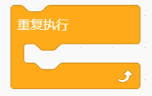
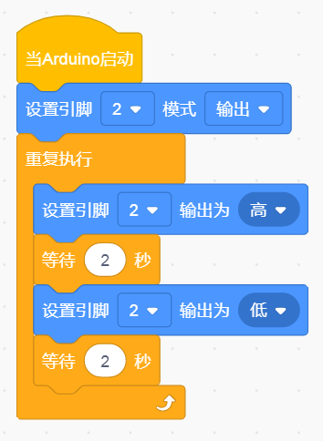
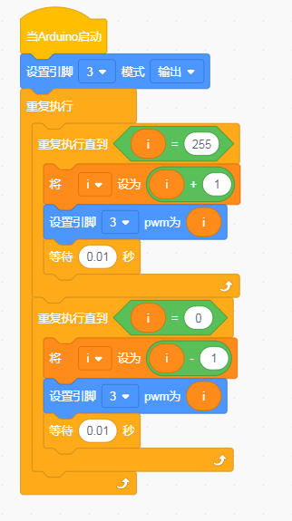

# Kidsblock

### 1. Kidsblock图形化编程软件介绍

**Kidsblock**是一款友好的图形化编程软件，专为初学者和儿童设计，旨在通过简单的拖放式编程方式，使用户快速掌握Arduino开发。该软件将编程逻辑以可视化形式呈现，用户可通过组合不同的模块（如事件、引脚控制、循环等）快速创建程序，而无需深入学习复杂的编程语言。

Kidsblock特别适用于教育和自学，提供了直观的开发环境，让学习编程变得轻松有趣。

---

### 2. 连接图

### 3. 测试代码

①在事件栏里拉出“Arduino启动”模块。

②在引脚栏拖出设置引脚输入/输出模块。

③在控制栏拖出无限循环模块。

④在引脚栏拖出设置引脚高低电平模块，设置管脚为2，电平为高，点亮LED。

⑤在控制栏目里拖出延时模块，设置为2秒。

⑥在引脚栏拖出设置引脚高低电平模块，设置管脚为2，电平为低，熄灭LED。

⑦再来一个延时2秒。

**完整代码**

### 4. 测试结果

烧录好测试代码，按照接线图连接好线；上电后，LED模块上的LED闪烁，亮2秒，灭2秒，循环交替。

### 5. 加强训练（呼吸灯）

这里我们就会涉及到一个脚PWM的控制方式，脉宽调制（PWM）基本原理：控制方式就是对逆变电路开关器件的通断进行控制，使输出端得到一系列幅值相等但宽度不一致的脉冲，用这些脉冲来代替正弦波或所需要的波形。也就是在输出波形的半个周期中产生多个脉冲，使各脉冲的等值电压为正弦波形，所获得的输出平滑且低次谐波少。按一定的规则对各脉冲的宽度进行调制，既可改变逆变电路输出电压的大小，也可改变输出频率。

简单了解了PWM的原理后我们需要把插在开发板数字口2的线换到数字口3，数字口3前面的波浪线“~”便是PWM的代表符号。

**代码**

**结果：**上传代码后LED会由暗变亮然后再由亮变到暗，这样我们便得到了一个呼吸灯。（如果没有实现这个功能，先检查LED的S端是否接在第3脚）

