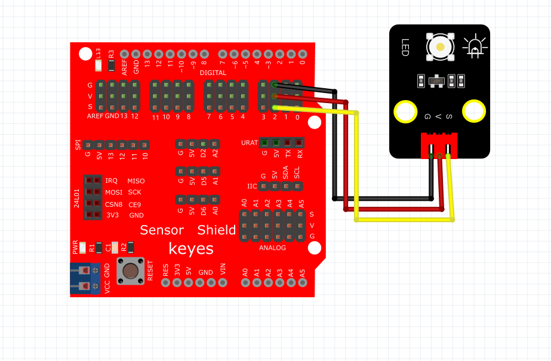
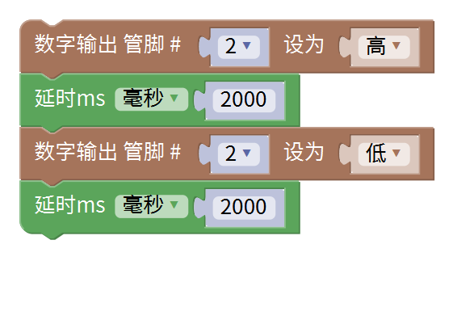
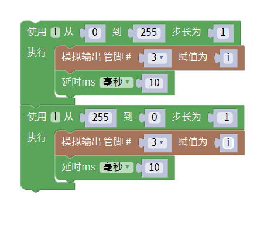

# Mixly

### 1. Mixly图形化编程软件介绍

**Mixly**是一款开源的图形化编程软件，旨在为初学者和教育工作者提供一种简单易用的编程环境。通过可视化的模块界面，用户可以拖拽不同的编程块来搭建程序，降低了编程的门槛，使得编程学习变得更加直观和有趣。

Mixly支持多种硬件，如Arduino等，适合于各种教育场景，尤其是在STEM教育中，帮助学生们实现创意项目，提高动手能力和逻辑思维能力。

---

### 2. 连接图

### 3. 测试代码

①在输入/输出栏拖出数字输出图标，设置管脚为2，电平为高，打开LED。

②在控制栏目里拖出延时模块，设置为2000毫秒。

③在输入/输出栏拖出数字输出图标，设置管脚为2，电平为低，熄灭LED。

④再来一个延时2000毫秒。

完整代码

### 4. 测试结果

烧录好测试代码，按照接线图连接好线；上电后，LED模块上的LED闪烁，亮2秒，灭2秒，循环交替。

### 5. 加强训练（呼吸灯）

这里我们就会涉及到一个脚PWM的控制方式，脉宽调制（PWM）基本原理：控制方式就是对逆变电路开关器件的通断进行控制，使输出端得到一系列幅值相等但宽度不一致的脉冲，用这些脉冲来代替正弦波或所需要的波形。也就是在输出波形的半个周期中产生多个脉冲，使各脉冲的等值电压为正弦波形，所获得的输出平滑且低次谐波少。按一定的规则对各脉冲的宽度进行调制，既可改变逆变电路输出电压的大小，也可改变输出频率。

简单了解了PWM的原理后我们需要把插在开发板数字口2的线换到数字口3，数字口3前面的波浪线“~”便是PWM的代表符号。

**代码：**

**结果：**上传代码后，LED会由暗变亮然后再由亮变到暗，这样我们便得到了一个呼吸灯。（如果没有实现这个功能，先检查LED的S端是否接在第3脚）
