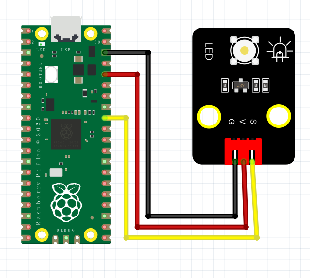

# Python

### 1. MicroPython编程软件介绍

**MicroPython**是一个旨在在微控制器和嵌入式系统上运行Python编程语言的实现。它设计用于运行在资源受限的设备上，并且提供了与硬件直接交互的简便方法。MicroPython不仅支持常见的Python功能，还提供了用于控制硬件的API，使得在单板计算机（如树莓派Pico）上的编程变得简单和直观。

MicroPython适合于教育、原型开发和物联网应用，帮助开发者和学生快速实现硬件控制和信号处理。

---

### 2. 连接图



### 3. 测试代码

```python
import machine
import utime

led_onboard = machine.Pin(27, machine.Pin.OUT)

while True:
    led_onboard.value(1)
    utime.sleep(2)
    led_onboard.value(0)
    utime.sleep(2)
```

### 4. 代码介绍

- **import machine**  
  机器库包含MicroPython需要与Pico和其他MicroPython兼容的设备通信的所有指令，扩展了物理计算的语言。

- **import utime**  
  “utime”库处理所有与时间有关的事情，从测量时间到将延迟插入到程序中，单位为秒。

- **led_onboard = machine.Pin(27, machine.Pin.OUT)**  
  第一个参数27是您正在设置的引脚的编号；第二个参数`machine.Pin.OUT`指示Pico，该引脚应作为输出使用。

- **utime.sleep(2)**  
  这调用utime库中的sleep函数，暂停程序输入的秒数——在本例中为2秒。

### 5. 测试结果

烧录好测试代码，按照接线图连接好线；上电后，LED模块上的LED闪烁，亮2秒，灭2秒，循环交替。

### 6. 加强训练（呼吸灯）

本部分涉及到PWM（脉宽调制）控制方式：

**代码示例：**

```python
import utime
from machine import Pin, PWM

PWM_PulseWidth = 0
# 使用树莓派Pico板上LED，构建PWM对象pwm_LED
pwm_LED = PWM(Pin(27))
# 设置pwm_LED频率
pwm_LED.freq(500)

while True:
    while PWM_PulseWidth < 65535:  # 循环条件为PWM_PulseWidth的值小于65535
        PWM_PulseWidth += 50  # 每次循环都加50
        utime.sleep_ms(1)  # 延时1ms
        pwm_LED.duty_u16(PWM_PulseWidth)  # 给引脚赋值

    while PWM_PulseWidth > 0:  # 循环条件为PWM_PulseWidth的值大于0
        PWM_PulseWidth -= 50  # 每次循环都减50
        utime.sleep_ms(1)  # 延时1ms
        pwm_LED.duty_u16(PWM_PulseWidth)  # 给引脚赋值
```

**结果：**上传代码后，LED会由暗变亮然后再由亮变到暗，这样我们便得到了一个呼吸灯。（如果没有实现这个功能，先检查LED的S端是否接在27脚）

